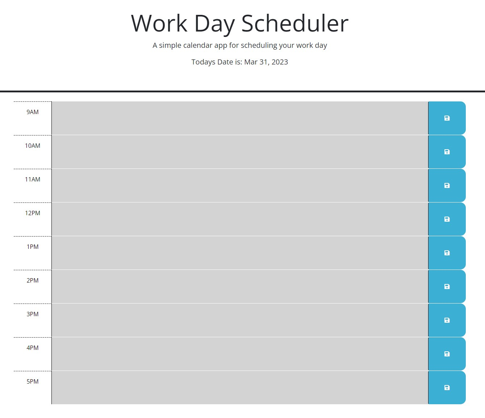

# 05 Third-Party APIs: Work Day Scheduler

## Deployment URL

url: https://austingrech.github.io/Business-Day-Scheduler/

## Mock Up



##About

```
- Created a daily planner where the current day is displayed.
- you are presented with time blocks for the business hours of 9am-5pm.
- anything typed within those time blocks will persist when the page is refreshed.
- past hours appear gray, current hour red, and future hours will appear green.
```

## Contributors

```
- Austin Grech
- Keegan Omel
- Bruno Rosarini
```